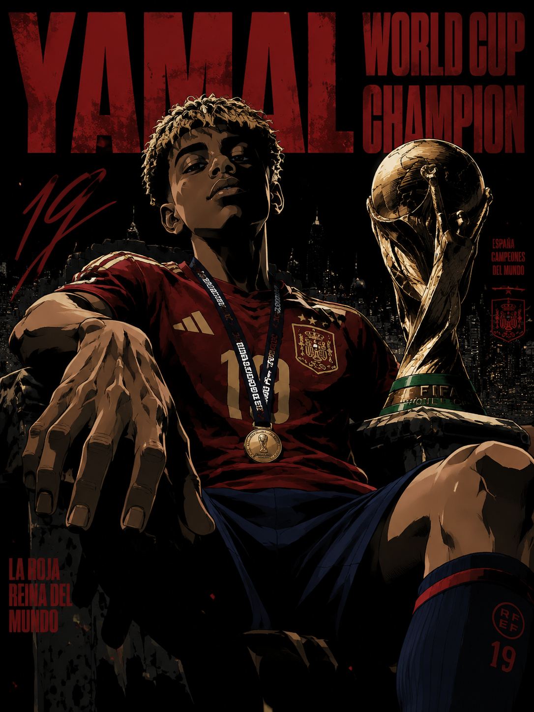
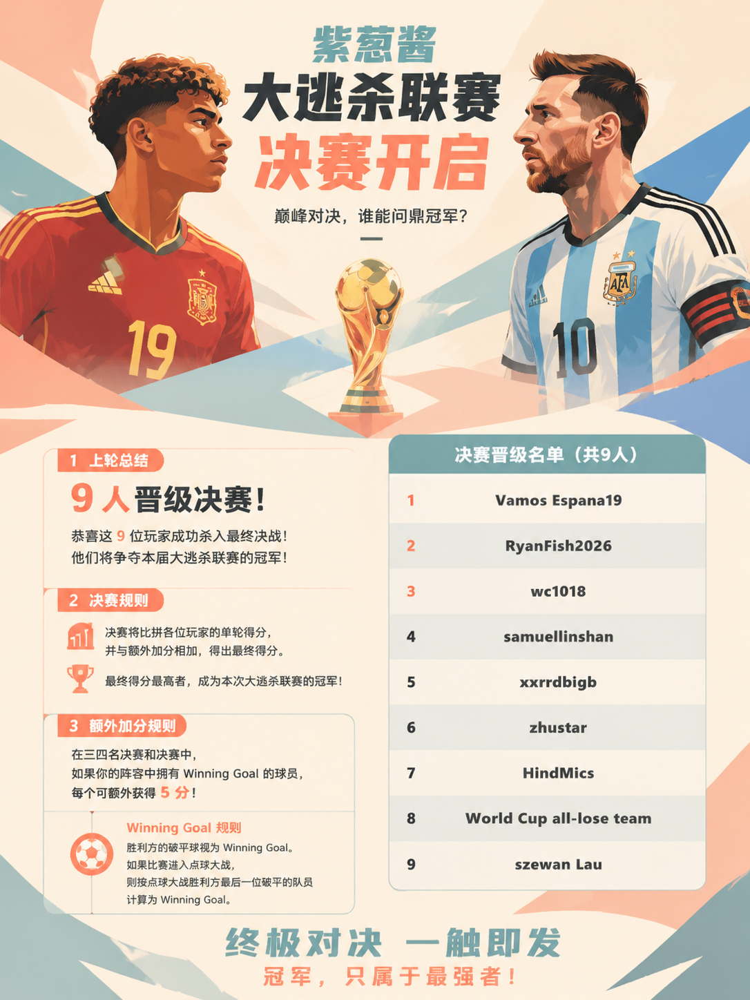
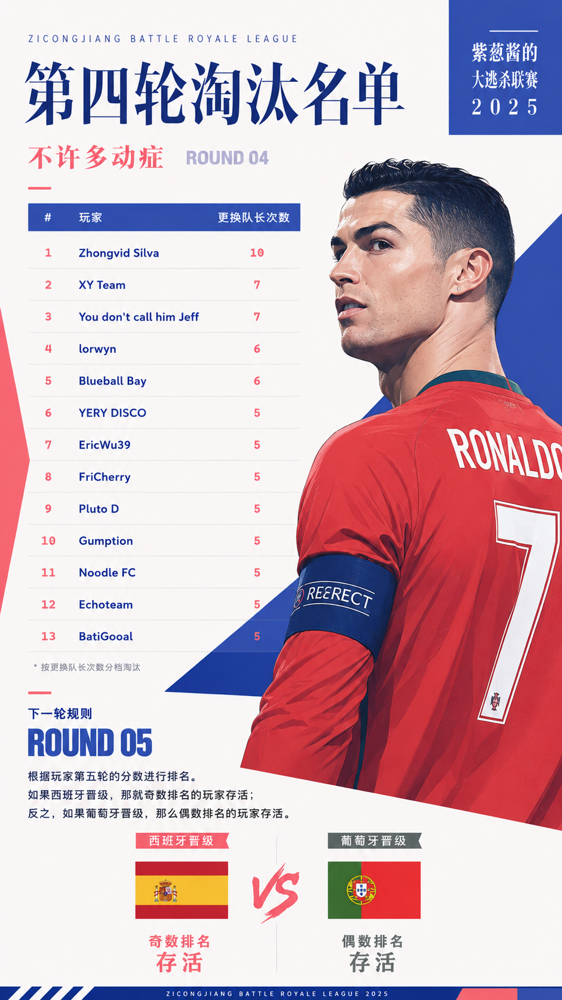

# 小红书提示词

**1080×1440（3:4）小红书竖版海报**

## 黑礁风格

高级日漫黑帮写实风格（Black Lagoon inspired），暗黑都市犯罪美学，成熟青年漫画风，硬朗锐利的赛璐璐上色，厚重阴影，大面积纯黑块塑造体积感，极强的黑白对比，高反差电影级光影，低饱和配色，以黑、深灰、暗红为主色，少量冷蓝点缀。人物拥有冷漠、危险、压迫感的神情，略微仰拍英雄视角，广角镜头，夸张透视，近景手部放大，低机位构图。背景采用极简设计，以巨大红色字体、工业都市元素、废弃建筑、霓虹灯、集装箱码头、地下停车场或黑帮城市为主，大面积负空间。整体充满90年代OVA动画质感，枪战电影氛围，成熟、暴力、冷酷、叛逆，具有漫画封面视觉冲击力。

## 韩系杂志

极简手绘插画混合韩系时装杂志封面，通过简约的线条和“大面积的纯色色块+5%高饱和撞色” 来成为构图的骨架，大面积留白和负空间，但不要有完全垂直的曲线

主体：西班牙的亚马尔和阿根廷的梅西目光相对，志在夺取大力神杯，光源来自于随机角度； 

负面约束：没有线稿，没有水印，没有图标，没有花瓶，没有花朵，没有植物，没有桌面静物，没有家居摆件

## 日系杂志

风格：高端日系时装杂志封面感插画，极简现代时装数字插画风格，精致赛璐璐上色，干净锐利的大色块塑型，几乎无线稿，边缘优雅清晰锐利；画面保持蓝白色骨架配色，同时加入少许珊瑚红、雾紫、浅黄、灰粉、鼠尾草绿、银灰等辅助色，整体保持简约、高级、统一、不花哨。背景干净，可为明亮的钴蓝、黄加蓝、雾蓝等纯净大色块，并保留大面积负空间。细节简化但造型准确，整体清透、时尚、冷艳，像高级杂志封面海报。

无复杂背景，写实摄影，无3D、无厚涂、无低幼卡通、无杂乱装饰。。