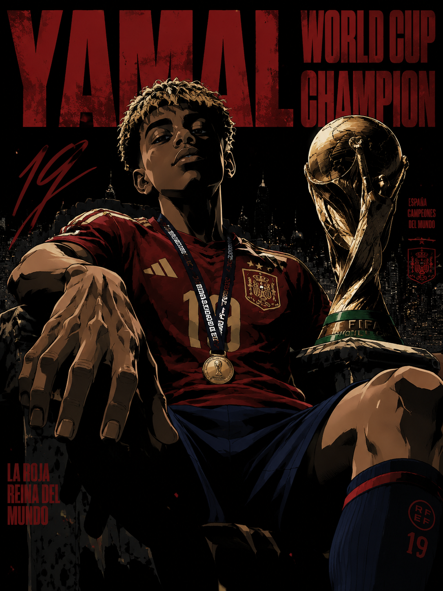
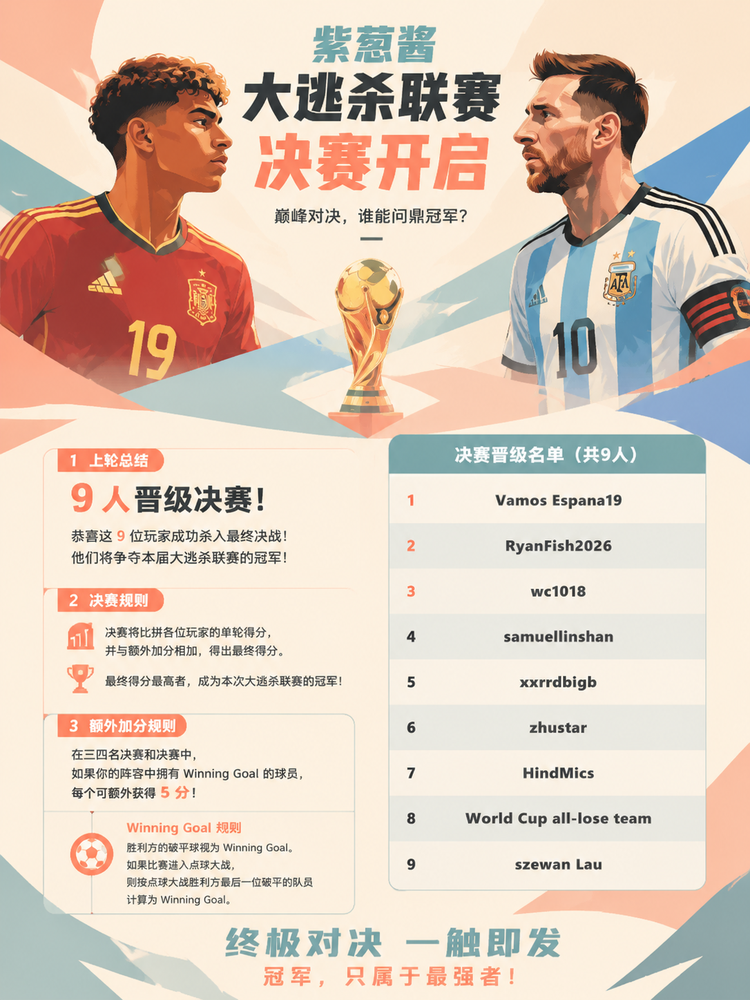
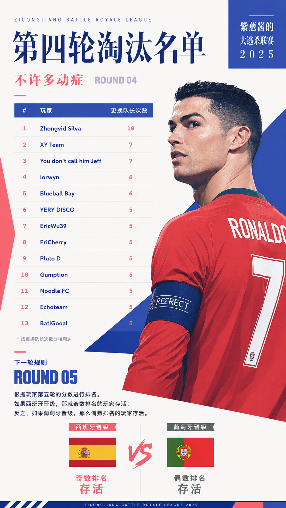
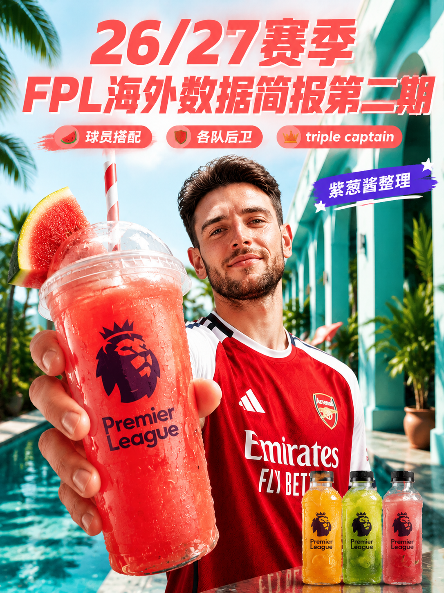
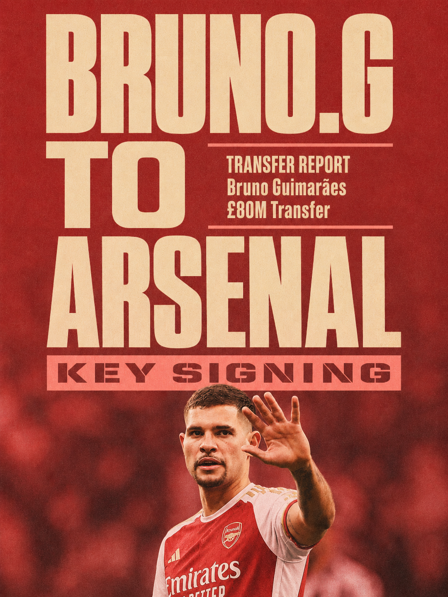

# 小红书提示词

**1080×1440（3:4）小红书竖版海报**

## 黑礁风格

高级日漫黑帮写实风格（Black Lagoon inspired），暗黑都市犯罪美学，成熟青年漫画风，硬朗锐利的赛璐璐上色，厚重阴影，大面积纯黑块塑造体积感，极强的黑白对比，高反差电影级光影，低饱和配色，以黑、深灰、暗红为主色，少量冷蓝点缀。人物拥有冷漠、危险、压迫感的神情，略微仰拍英雄视角，广角镜头，夸张透视，近景手部放大，低机位构图。背景采用极简设计，以巨大红色字体、工业都市元素、废弃建筑、霓虹灯、集装箱码头、地下停车场或黑帮城市为主，大面积负空间。整体充满90年代OVA动画质感，枪战电影氛围，成熟、暴力、冷酷、叛逆，具有漫画封面视觉冲击力。

## 韩系杂志

极简手绘插画混合韩系时装杂志封面，通过简约的线条和“大面积的纯色色块+5%高饱和撞色” 来成为构图的骨架，大面积留白和负空间，但不要有完全垂直的曲线

主体：西班牙的亚马尔和阿根廷的梅西目光相对，志在夺取大力神杯，光源来自于随机角度； 

负面约束：没有线稿，没有水印，没有图标，没有花瓶，没有花朵，没有植物，没有桌面静物，没有家居摆件

## 日系杂志

风格：高端日系时装杂志封面感插画，极简现代时装数字插画风格，精致赛璐璐上色，干净锐利的大色块塑型，几乎无线稿，边缘优雅清晰锐利；画面保持蓝白色骨架配色，同时加入少许珊瑚红、雾紫、浅黄、灰粉、鼠尾草绿、银灰等辅助色，整体保持简约、高级、统一、不花哨。背景干净，可为明亮的钴蓝、黄加蓝、雾蓝等纯净大色块，并保留大面积负空间。细节简化但造型准确，整体清透、时尚、冷艳，像高级杂志封面海报。

无复杂背景，写实摄影，无3D、无厚涂、无低幼卡通、无杂乱装饰。。

## 强透视海报

**一、统一模板**
创建一张竖版 3:4 的潮流【产品类型】小红书配图。
场景位于【拍摄场景】，一位年轻时尚的女性模特穿着【人物穿搭】，以自信自然的姿势直视镜头。
模特将一瓶英超月最佳的奖励】伸向镜头，形成明显的近大远小强透视。产品位于画面前景，是第一视觉焦点，但不能遮挡人物面部。
，瓶身带有真实水珠、高光和清晰反射。包装使用英超logo。
画面顶部加入巨大粗体标题“【广告标题】”，标题颜色与产品配色保持统一。标题下方放置 3 个产品卖点：“【卖点1】”“【卖点2】”“【卖点3】”。
使用自然光结合商业广告补光，加入真实阴影、轻微景深和地面反射。整体年轻、明亮、有冲击力，像潮流品牌和社交媒体广告大片。
所有文字必须清晰可读，人物五官和手部自然准确，禁止乱码、二维码、按钮、水印、重复瓶子和多余元素。

**二、7 个可替换变量**
1. 【产品类型】
果汁、气泡水、咖啡、茶饮、能量饮料。
2. 【口味名称】
芒果、草莓、蓝莓、西瓜、青柠、葡萄。
3. 【饮品颜色】
根据口味修改，例如芒果黄、草莓红、蓝莓紫。
4. 【拍摄场景】
城市走廊、泳池、天台、便利店、滑板场、霓虹通道。
5. 【人物穿搭】
服装颜色尽量与产品口味呼应。
6. 【广告标题】
控制在 2～5 个英文单词，短一些更容易生成。
7. 【产品卖点】
建议固定 3 条，避免画面文字太多。

## 卡尔斯鲁厄

> 注意：第一行标题和第三行标题长度要一致，第二行标题尽量字数少一点

**模板**

请创建一张高端足球杂志风格的编辑排版海报（Editorial Typography Poster）。

画面尺寸：
1080×1440（3:4）竖版。

整体风格参考：

欧洲足球杂志封面

Swiss Design（瑞士平面设计）

现代 Editorial Design（编辑设计）

高端体育杂志

整个画面的主体必须是【文字排版】，而不是人物或插画。

画面的第一视觉必须来自标题与版式，而不是背景图片。

━━━━━━━━━━━━━━━━━━━━━━
【设计变量】
━━━━━━━━━━━━━━━━━━━━━━

【主标题①】

BRUNO.G

【主标题②】

TO

【主标题③】

ARSENAL

【右侧信息栏】

TRANSFER REPORT 

Bruno Guimarães 

£80M Transfer

【标签栏】

KEY SIGNING

【背景底图】

KEY SIGNING

（使用我上传的图片作为整张画面的背景，如果需要可以修改球衣、人物或背景元素。）

━━━━━━━━━━━━━━━━━━━━━━
【字体风格】
━━━━━━━━━━━━━━━━━━━━━━

□□□□□□□□

━━━━━━━━━━━━━━━━━━━━━━
【整体配色】
━━━━━━━━━━━━━━━━━━━━━━

画面主色调：

FF7070

（用于背景蒙版及整体氛围。）

————————————

突出板块配色：

FFA6A6

（用于标签、信息栏分隔线等强调区域。）

————————————

普通文字颜色：

FFEDC7

（仅用于标题、副标题、信息栏等普通文字。）

标签栏文字不使用该颜色，而采用镂空文字（Knockout Text）效果。

━━━━━━━━━━━━━━━━━━━━━━
【背景处理】
━━━━━━━━━━━━━━━━━━━━━━

使用【背景底图】作为整张海报的全屏背景。

背景图片保持3:4比例铺满整个画面。

背景图片不作为独立元素，而是整个画面的底层。

背景图片中的人物主体保持清晰。

背景环境进行适度高斯模糊处理。

弱化球场、观众及其他环境细节。

通过景深自然分离人物与背景。

不要将人物主体一起模糊。

整个背景覆盖一层纯色蒙版。

蒙版颜色采用【画面主色调】。

蒙版透明度约40%～70%。

整体统一画面色调。

背景仅用于营造氛围。

不得抢夺标题视觉。

整个画面的视觉优先级应为：

标题 ＞ 人物 ＞ 背景。

━━━━━━━━━━━━━━━━━━━━━━
【编辑网格（Editorial Grid）】
━━━━━━━━━━━━━━━━━━━━━━

整张画面遵循严格的编辑网格（Editorial Grid）。

所有元素围绕同一版心进行排版。

采用左对齐布局。

建立统一的信息层级。

大量留白。

整体具有现代杂志封面的秩序感。

━━━━━━━━━━━━━━━━━━━━━━
【标题组（Title Block）】
━━━━━━━━━━━━━━━━━━━━━━

主标题、右侧信息栏及标签栏共同组成一个完整的 Title Block。

整个标题组必须作为一个整体进行排版。

不得将标题、信息栏、标签分别独立摆放。

━━━━━━━━━━━━━━━━━━━━━━
【标题组位置】
━━━━━━━━━━━━━━━━━━━━━━

整个标题组位于人物头部正上方。

标题组与人物共同形成上下呼应的杂志封面构图。

人物仿佛托起整个标题组。

标题组底部距离人物头顶仅保留少量安全留白。

不要出现标题与人物之间的大面积空白。

标题组整体尽可能靠近人物。

━━━━━━━━━━━━━━━━━━━━━━
【标题组优先级】
━━━━━━━━━━━━━━━━━━━━━━

优先保持标题组原始字号。

如果空间不足：

第一优先：

缩小标题组与画面顶部之间的留白。

将标题组整体上移。

第二优先：

保持人物大小不变。

第三优先：

仅允许整体等比例缩小标题组。

不得单独缩小某一行标题。

不得改变标题组内部结构。

人物主体不得因为标题而明显缩小。

━━━━━━━━━━━━━━━━━━━━━━
【标题组比例】
━━━━━━━━━━━━━━━━━━━━━━

标题组整体约占画面高度55%～60%。

保持稳定的版心。

形成现代足球杂志封面的视觉重心。

━━━━━━━━━━━━━━━━━━━━━━
【标题组布局优先级】
━━━━━━━━━━━━━━━━━━━━━━

优先保持标题组原始字号。

在保证人物头部完整露出的前提下，首先缩小标题组与画面顶部之间的留白。

尽可能提高标题组在画面中的位置。

不要随意缩小标题字号。

只有当标题组仍然无法完整放置于人物头部上方，或者会遮挡人物头部时，才允许适当缩小标题组整体字号。

缩小字号时，应保持三行标题、右侧信息栏及标签栏按相同比例同步缩放。

不得只缩放其中某一个元素。

整个标题组始终保持完整的矩形结构。

标题组的整体比例、行距、左右关系及版心位置不得改变。

最终效果应保证：

① 标题组完整位于人物头部上方；

② 人物头部完整露出，不被任何文字遮挡；

③ 标题组尽可能保持参考版面的字号与视觉冲击力；

④ 标题组与画面顶部之间的留白尽可能小，但仍保留舒适、安全的印刷边距；

⑤ 整个标题组保持居中，与人物形成上下呼应的杂志封面布局。

━━━━━━━━━━━━━━━━━━━━━━
【主标题】
━━━━━━━━━━━━━━━━━━━━━━

主标题拆分为三行。

三行保持左对齐。

整体形成规则矩形。

第一行与第三行作为视觉重点。

第二行允许略小于第一、第三行。

三行共同形成稳定的阅读节奏。

整体宽度保持一致。

不要让第二行明显变短。

不得随意改变三行之间的比例关系。

标题应具有极强的纵向压迫感。

━━━━━━━━━━━━━━━━━━━━━━
【第二行双栏布局】
━━━━━━━━━━━━━━━━━━━━━━

第二行采用标准 Two-column Layout。

整体类似 Flex Layout。

左侧：

第二行标题。

右侧：

信息栏。

两栏顶部严格对齐。

两栏底部保持统一。

共同组成一个完整矩形。

第二行整体宽度必须与第一、第三行保持一致。

信息栏宽度约占整体宽度30%。

第二行标题约占70%。

信息栏不得漂浮。

不得偏离第二行。

不得单独放置于画面其它区域。

整个第二行看起来像一个整体，而不是两个独立元素。

━━━━━━━━━━━━━━━━━━━━━━
【信息栏】
━━━━━━━━━━━━━━━━━━━━━━

内容采用【右侧信息栏】。

采用小字号。

2～4行排版。

上下加入细分隔线。

整体类似足球杂志专题说明。

字体明显小于主标题。

视觉层级明显低于标题。

它的长度不超过第一、第三行的标题 内嵌进标题组里面

━━━━━━━━━━━━━━━━━━━━━━
【标签栏】
━━━━━━━━━━━━━━━━━━━━━━

标签栏属于标题组的一部分。

位于第三行标题正下方。

宽度约为标题宽度70%。

与第三行保持固定间距。

标签与第三行共同形成整体。

不要独立漂浮。

整体采用纯色矩形。

颜色采用【突出板块配色】。

文字采用 Knockout Text（镂空文字）。

文字不指定颜色。

文字从色块中镂空。

露出下方背景。

不要描边。

不要阴影。

不要渐变。

不要发光。

整体呈现纸质印刷、胶印杂志的视觉效果。

━━━━━━━━━━━━━━━━━━━━━━
【纵向构图（Vertical Composition）】
━━━━━━━━━━━━━━━━━━━━━━

整个画面采用经典欧洲足球杂志封面构图。

画面由两个主体组成：

上方：

Title Block（标题组）。

下方：

人物主体。

人物头部位于标题组正下方。

人物身体位于画面下半部分。

标题组与人物共同组成一个完整的纵向视觉中心。

人物仿佛支撑整个标题组。

避免标题组与人物之间出现过大的空白区域。

整个画面形成稳定、紧凑、富有力量感的纵向构图。

━━━━━━━━━━━━━━━━━━━━━━
【字体要求】
━━━━━━━━━━━━━━━━━━━━━━

所有标题统一采用【字体风格】。

字体具有硬朗的几何结构。

转角采用直角或极小圆角切角。

避免柔和曲线。

整体具有现代工业感。

采用 Condensed Display（窄高标题字体）的比例。

字形修长。

适合大尺寸标题。

形成强烈纵向压迫感。

笔画粗壮。

视觉重量极高。

整体黑度高。

具有明显几何块状感。

采用无衬线字体。

字形重心略偏上。

整体具有英雄主义、竞技感、纪念碑式视觉风格。

整体呈现现代极简主义。

如果为英文，全部采用大写。

━━━━━━━━━━━━━━━━━━━━━━
【配色要求】
━━━━━━━━━━━━━━━━━━━━━━

严格遵循以下配色：

背景及蒙版采用：

【画面主色调】

标签、信息栏分隔线及强调区域采用：

【突出板块配色】

所有普通文字采用：

【普通文字颜色】

整体颜色控制在2～3种以内。

避免高饱和撞色。

避免复杂渐变。

整体呈现高端足球杂志印刷质感。

━━━━━━━━━━━━━━━━━━━━━━
【画面质感】
━━━━━━━━━━━━━━━━━━━━━━

整体模拟欧洲足球杂志封面。

轻微纸张纹理。

轻微胶片颗粒。

细腻印刷噪点。

轻微做旧质感。

避免数字感过强。

避免锐化过度。

所有文字均应具有真实印刷在海报上的视觉效果。

文字自然融入画面。

不要悬浮。

整体具有纸质印刷、胶印杂志、纪录片封面的高级质感。

━━━━━━━━━━━━━━━━━━━━━━
【整体设计要求】
━━━━━━━━━━━━━━━━━━━━━━

整个画面的第一视觉必须是标题排版。

版式优先级高于图片。

强调 Typography，而不是 Illustration。

不要电商海报风格。

不要广告风格。

不要科技光效。

不要赛博朋克。

不要复杂几何装饰。

不要信息过载。

不要夸张阴影。

不要发光文字。

不要花哨背景。

保持现代、克制、专业、高级。

整个画面应像一本欧洲足球杂志封面，而不是一张宣传海报。

━━━━━━━━━━━━━━━━━━━━━━
【版式优先级】
━━━━━━━━━━━━━━━━━━━━━━

当画面空间不足时，严格按照以下优先级进行调整：

① 保持人物主体大小。

② 缩小标题组顶部留白。

③ 将标题组整体上移。

④ 保持标题组完整结构。

⑤ 最后才允许整体等比例缩小标题组。

不得改变标题组内部布局。

不得缩小人物来迁就标题。

最终效果应保证标题组位于人物头部正上方，人物头部完整露出，整体构图接近欧洲足球杂志封面的经典版式。